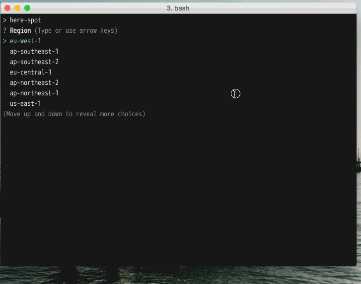
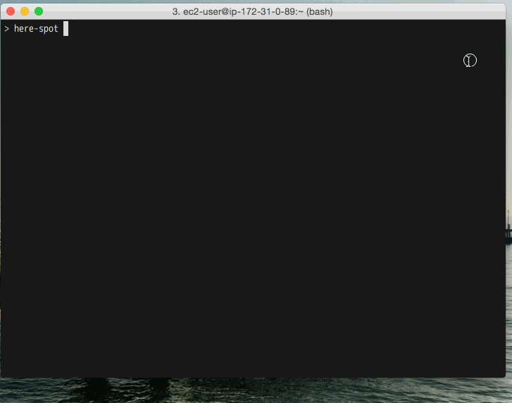

# here-spot

Quickly spin up an AWS spot instance from the command line.

## Install
```
npm install -g here-spot
```

## Usage

### here-spot

```
here-spot [--region REGION] [--instance-type TYPE] [--image-id AMI] [--key-name KEYPAIR_NAME]
```





### aws-spot-history

Utility to print recent spot price history as NDJSON

```sh
> aws-spot-history us-west-2 10m g2.2xlarge
{"timestamp":"2016-03-28T22:53:51.000Z","us-west-2a":"0.750000"}
{"timestamp":"2016-03-29T07:01:04.000Z","us-west-2a":"0.750000","us-west-2c":"0.750000"}
{"timestamp":"2016-03-29T07:01:04.000Z","us-west-2a":"0.750000","us-west-2b":"0.750000","us-west-2c":"0.750000"}
{"timestamp":"2016-03-29T11:49:02.000Z","us-west-2a":"0.750000","us-west-2b":"0.750000","us-west-2c":"7.670000"}
{"timestamp":"2016-03-29T12:09:30.000Z","us-west-2a":"0.750000","us-west-2b":"0.650000","us-west-2c":"7.670000"}
{"timestamp":"2016-03-29T12:18:47.000Z","us-west-2a":"0.750000","us-west-2b":"0.241600","us-west-2c":"7.670000"}
{"timestamp":"2016-03-29T12:18:48.000Z","us-west-2a":"0.750000","us-west-2b":"0.241600","us-west-2c":"0.650000"}
{"timestamp":"2016-03-29T12:27:56.000Z","us-west-2a":"0.168200","us-west-2b":"0.241600","us-west-2c":"0.650000"}
{"timestamp":"2016-03-29T12:27:57.000Z","us-west-2a":"0.650000","us-west-2b":"0.241600","us-west-2c":"0.650000"}
{"timestamp":"2016-03-29T12:30:57.000Z","us-west-2a":"0.254000","us-west-2b":"0.241600","us-west-2c":"0.650000"}
{"timestamp":"2016-03-29T12:30:57.000Z","us-west-2a":"0.254000","us-west-2b":"0.348700","us-west-2c":"0.650000"}
{"timestamp":"2016-03-29T12:30:58.000Z","us-west-2a":"2.000000","us-west-2b":"0.348700","us-west-2c":"0.650000"}
{"timestamp":"2016-03-29T12:31:59.000Z","us-west-2a":"7.670000","us-west-2b":"0.348700","us-west-2c":"0.650000"}
{"timestamp":"2016-03-29T12:35:02.000Z","us-west-2a":"7.670000","us-west-2b":"7.670000","us-west-2c":"0.650000"}
```

## License

MIT
